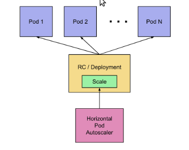

# HORIZONTAL PODS AUTOSCALER
This directory contains a horizontal pods autoscaler. A HPA automatically scales the number of pods in a replication controller, deployment or replica set based on observed CPU utilization.

# COMMANDS USED

### **Shows addons list**

> minikube addons list

### **Enable minikube**

> minikube addons enable metrics-server

### **Get kube-system**

> kubectl -n kube-system get pods

### **Get all data**

> kubectl get all

### **Get CPU and Memory of pods**

> kubectl top pods
