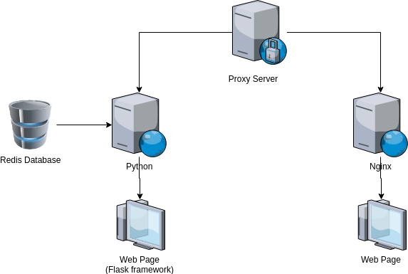

# PROXY SERVER

> Dockerfile from nginx base image that will work as proxy server. This container will act as a proxy for the python and the nginx/static container. This container uses 4 dockerfiles to run.

> ### Dockerfiles:
>
> - #### Redis
>   > Redis image that will serve as the database for the python app.
> - #### Flask:
>   > Python image that have python installed in it and flask framework.
> - #### Nginx:
>   > Nginx image that will contain your static files.
> - #### Proxy:
>   > Nginx image thaht will work as your proxy server

